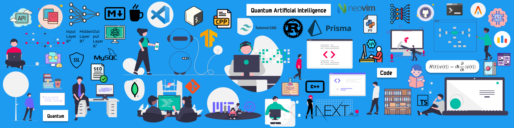

<h1 align="left">Hi , I'm Atiq Urrehaman</h1>

 
 

# 💫About Me

- 🔭 I’m currently working on [Base-X](https://github.com/Adam-Al-Rahman/base-x#readme)

- 🌱 I’m currently learning **Rust: Programming language**

- 👨‍💻 All of my projects are available at [https://atiq-ur-rehaman.netlify.app/](https://atiq-ur-rehaman.netlify.app/)

- 💬 Ask me about **Tensorflow, Nextjs, Tailwindcss**

- 📫 How to reach me **atiqurrehaman0@gmail.com**

- 📄 Know about my experiences [https://atiq-ur-rehaman.netlify.app/resume.pdf](https://atiq-ur-rehaman.netlify.app/resume.pdf)

 

## 🌐Socials

       

 

# 💻Tech Stack

                             

 

# 📊GitHub Stats

 
 

 

## 🏆GitHub Trophies

 

## GitHub Contribution

 

### ✍️Random Dev Quote

---

